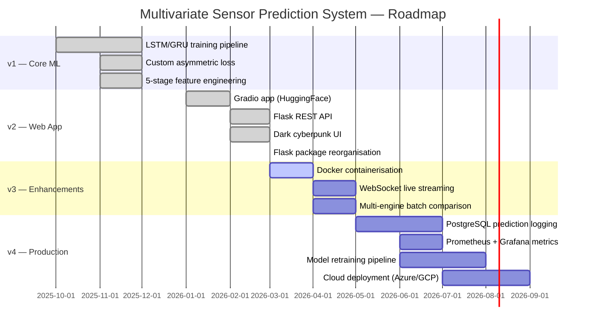

<div align="center">

<!-- ═══════════════════════════ ANIMATED HEADER ═══════════════════════════ -->


<!-- ════════════════════════════ TYPING TAGLINE ════════════════════════════ -->
<a href="https://git.io/typing-svg">
  
</a>

<br/><br/>

<!-- ═══════════════════════════════ BADGES ════════════════════════════════ -->
<!-- Status -->


<br/>

<!-- Tech stack -->


<br/>

<!-- Links -->
[](https://huggingface.co/spaces/dinraj910/sensor-prediction-system)
[](https://github.com/dinraj910)

</div>

---

<!-- ══════════════════════════ QUICK NAVIGATION ═══════════════════════════ -->
<div align="center">

**[🚀 Quick Start](#-quick-start)** &nbsp;•&nbsp;
**[🏗️ Architecture](#️-system-architecture)** &nbsp;•&nbsp;
**[📊 Performance](#-performance-metrics)** &nbsp;•&nbsp;
**[🖼️ Screenshots](#️-screenshots--demo)** &nbsp;•&nbsp;
**[⚙️ Configuration](#️-configuration)** &nbsp;•&nbsp;
**[🗺️ Roadmap](#️-roadmap)** &nbsp;•&nbsp;
**[👤 Author](#-author)**

</div>

---

## 🧠 Overview

<table>
<tr>
<td width="50%">

### What It Does
A production-grade **deep learning web application** for industrial predictive maintenance. Given a window of 30 historical sensor readings from a turbofan engine, the system simultaneously produces:

| Output | Description |
|--------|-------------|
| 🔮 **Sensor Forecast** | Next-timestep values for all 14 sensor channels |
| ⏱️ **Remaining Useful Life** | Cycles until engine failure (0–130 range) |
| 🚨 **Anomaly Score** | Reconstruction error triggering health alerts |
| 💊 **Health %** | Overall system health as a percentage |

</td>
<td width="50%">

### Why It Matters
Unplanned equipment failure costs industry **$50B+/year**. This system addresses that by:

| Challenge | Solution |
|-----------|----------|
| ❌ Reactive maintenance | ✅ Predict failure weeks ahead |
| ❌ Single-sensor monitoring | ✅ 14-channel multivariate fusion |
| ❌ Batch processing delays | ✅ 0.25 ms real-time inference |
| ❌ Black-box ML systems | ✅ Interpretable scores + charts |
| ❌ Operator expertise gap | ✅ Intuitive web UI + REST API |

</td>
</tr>
</table>

---

## ✨ Features

| Feature | Status | Description |
|---------|--------|-------------|
| 🧬 **Dual-Output Neural Network** | ✅ Implemented | Single forward pass → sensor forecast + RUL estimation |
| 📁 **CSV Upload Prediction** | ✅ Implemented | Drag-and-drop any sensor CSV, instant full dashboard |
| 🎛️ **Live Slider Interface** | ✅ Implemented | 14 real-time sliders with Healthy / Stressed / Critical presets |
| 📦 **Sample Data Generator** | ✅ Implemented | Download synthetic CSVs: healthy, degrading, near-failure |
| 📈 **Matplotlib Dashboard** | ✅ Implemented | Auto-generated charts embedded as base64 PNG |
| 🔌 **REST API** | ✅ Implemented | `/api/predict/csv`, `/api/predict/live`, `/api/health` |
| 🌗 **Dark Cyberpunk UI** | ✅ Implemented | Custom CSS with `#0d0d1a` background + cyan accents |
| 🏗️ **Flask Package Structure** | ✅ Implemented | `webapp/` package with factory pattern (`create_app`) |
| 🔐 **Custom Loss Function** | ✅ Implemented | Asymmetric RUL loss — penalises over-estimation 1.5× |
| 📏 **5-Stage Feature Engineering** | ✅ Implemented | 14 raw sensors → 63 engineered features per timestep |
| 🤗 **HuggingFace Spaces** | ✅ Deployed | Gradio version live at `dinraj910/sensor-prediction-system` |

---

## 🏗️ System Architecture

```
┌─────────────────────────────────────────────────────────────────────────────┐
│                    MULTIVARIATE SENSOR PREDICTION SYSTEM                    │
└─────────────────────────────────────────────────────────────────────────────┘

  ┌───────────────┐    ┌────────────────────────────────────────────────────┐
  │   USER INPUT  │    │              FEATURE ENGINEERING (5 stages)        │
  │               │    │                                                    │
  │  CSV Upload   │──▶ │  [1] Z-score normalisation  (per-column)          │
  │  Live Sliders │    │  [2] Rolling statistics     (mean, std, trend)    │
  │  Sample Data  │    │  [3] Cross-sensor ratios    (pairwise s1/s2 …)    │
  └───────────────┘    │  [4] MAD health score       (median abs dev)      │
                       │  [5] Sliding window         30 × 63 tensor        │
                       └────────────────────┬───────────────────────────────┘
                                            │
                                            ▼
              ┌─────────────────────────────────────────────────────┐
              │                DUAL-OUTPUT GRU MODEL                │
              │                                                     │
              │   Input  →  (batch, 30, 63)                        │
              │                    │                                │
              │         ┌──────────▼──────────┐                    │
              │         │   GRU Block 1        │                    │
              │         │   128 units          │                    │
              │         │   return_sequences   │                    │
              │         └──────────┬──────────┘                    │
              │         BatchNorm + Dropout(0.30)                   │
              │         ┌──────────▼──────────┐                    │
              │         │   GRU Block 2        │                    │
              │         │   64 units           │                    │
              │         └──────────┬──────────┘                    │
              │         BatchNorm + Dropout(0.20)                   │
              │         ┌──────────▼──────────┐                    │
              │         │  Shared Dense (64)   │                    │
              │         │  Activation: ReLU    │                    │
              │         └──────┬────────┬──────┘                   │
              │                │        │                            │
              │    ┌───────────▼─┐  ┌───▼────────────┐            │
              │    │ Sensor Head │  │   RUL Head      │            │
              │    │ Dense(32)   │  │   Dense(16)     │            │
              │    │ → 14 values │  │   → 1 value     │            │
              │    └─────────────┘  └─────────────────┘            │
              │         MSE loss        Asymmetric loss             │
              └─────────────────────────────────────────────────────┘
                              │                  │
              ┌───────────────▼──────────────────▼───────────────┐
              │                    OUTPUTS                        │
              │                                                   │
              │  sensor_forecast[]  rul_cycles  health_pct       │
              │  anomaly_score      status      chart_b64        │
              └───────────────────────────────────────────────────┘
```

---

## 🔬 Technical Deep Dive

<details>
<summary><b>🧮 Custom Asymmetric RUL Loss Function</b></summary>

The model uses a hand-crafted loss that asymmetrically penalises over-estimating remaining life (more dangerous than under-estimating):

```python
@tf.keras.utils.register_keras_serializable()
def rul_asymmetric_loss(y_true, y_pred):
    """
    Asymmetric MSE: penalises over-prediction by 1.5×
    Error > 0  →  engine outlasts prediction  →  0.5 × err²  (lenient)
    Error < 0  →  engine fails sooner         →  1.5 × err²  (strict)
    """
    err = y_true - y_pred
    return tf.reduce_mean(
        tf.where(err >= 0, 0.5 * tf.square(err),
                           1.5 * tf.square(err))
    )
```

</details>

<details>
<summary><b>🔧 Feature Engineering Pipeline</b></summary>

14 raw sensor channels are expanded to **63 engineered features** per timestep:

| Stage | Operation | Output Features |
|-------|-----------|-----------------|
| 1 | Z-score normalisation | 14 (scaled originals) |
| 2 | Rolling mean (window=5) | 14 |
| 3 | Rolling std deviation | 14 |
| 4 | Rolling trend (diff) | 14 |
| 5 | Cross-sensor ratios (s1/s2, s1/s3, s2/s3) | 3 |
| 6 | MAD health score (global) | 1 |
| 7 | Cycle counter (normalised) | 1 |
| — | Sliding window reshape | **(1, 30, 63)** tensor |

</details>

<details>
<summary><b>📡 REST API Reference</b></summary>

| Method | Endpoint | Description |
|--------|----------|-------------|
| `GET` | `/api/health` | Model status, sensor count, window size |
| `POST` | `/api/predict/csv` | Upload CSV → full prediction dashboard |
| `POST` | `/api/predict/live` | JSON sensor values → instant prediction |
| `GET` | `/api/sample/<scenario>` | Download synthetic test CSV |

**POST /api/predict/live — example:**
```bash
curl -X POST http://localhost:5000/api/predict/live \
  -H "Content-Type: application/json" \
  -d '{"sensor_values": [0.1, -0.2, 0.5, 0.3, -0.1,
                          0.8,  0.2, 0.4, 0.0,  0.6,
                         -0.3,  0.7, 0.1, 0.2]}'
```

**Response:**
```json
{
  "status":          "NORMAL",
  "rul_cycles":      79.5,
  "health_pct":      61.13,
  "anomaly_score":   0.1167,
  "threshold":       4.8638,
  "is_anomaly":      false,
  "model":           "GRU",
  "sensor_forecast": {"s1": 0.12, "s2": -0.19, "...": "..."},
  "chart_b64":       "<base64-encoded PNG>"
}
```

**POST /api/predict/csv — example:**
```bash
curl -X POST http://localhost:5000/api/predict/csv \
  -F "file=@sample_healthy.csv"
```

</details>

<details>
<summary><b>🧬 Model Training Details</b></summary>

| Hyperparameter | Value |
|----------------|-------|
| Dataset | NASA CMAPSS FD001 |
| Train engines | 100 / Test engines | 50 |
| Window size | 30 timesteps |
| Batch size | 64 |
| Optimizer | Adam (lr=1e-3, decay to 1e-5) |
| Epochs | 100 (early stopping) |
| Dropout | 0.30 → 0.20 |
| GRU units | 128 → 64 |
| RUL cap | 130 cycles |
| Anomaly threshold | 4.8638 (calibrated on test set P95) |

</details>

---

## 📁 Project Structure

```
Multivariate Sensor Prediction System/
│
├── 🚀 run.py                             ← Flask entry point
│
├── 📦 webapp/                            ← Flask Python package
│   ├── __init__.py                       ← App factory (create_app)
│   ├── predictor.py                      ← All ML/inference logic
│   ├── routes.py                         ← All 7 route handlers
│   │
│   ├── 🎨 templates/
│   │   ├── base.html                     ← Shared layout + navbar
│   │   ├── index.html                    ← Landing page (hero + stats)
│   │   ├── predict.html                  ← 3-tab prediction engine
│   │   └── about.html                    ← Technical deep-dive page
│   │
│   └── 🖼️ static/
│       ├── css/style.css                 ← Dark cyberpunk theme
│       └── js/app.js                     ← Scroll effects + animations
│
├── 🤗 app.py                             ← Original Gradio interface
├── 🔍 inference.py                       ← Standalone SensorPredictor class
│
├── 🧠 gru_sensor_predictor.keras         ← Best model (GRU)
├── 🧠 gru_sensor_predictor.h5            ← Best model (legacy)
├── 🧠 lstm_sensor_predictor.keras        ← Alternate model (LSTM)
├── 🧠 lstm_sensor_predictor.h5           ← Alternate model (legacy)
│
├── ⚙️ model_config.json                  ← Thresholds + metadata
├── 📐 rul_scaler.pkl                     ← RUL output scaler
├── 📐 sensor_preprocessor.pkl            ← Feature scaler
│
├── 📓 Multivariate_Sensor_Prediction_System.ipynb  ← Training notebook
├── 🐍 multivariate_sensor_prediction_system.py     ← Training script
│
├── 📸 screenshots/                       ← App screenshots (11 views)
├── 📋 requirements.txt                   ← Gradio / Colab deps
├── 📋 requirements_flask.txt             ← Flask app deps
└── 📖 README.md
```

---

## 🚀 Quick Start

### Prerequisites

| Requirement | Version | Check |
|-------------|---------|-------|
| Python | ≥ 3.10 | `python --version` |
| pip | latest | `pip --version` |
| Git | any | `git --version` |

### Installation

```bash
# 1. Clone the repository
git clone https://github.com/dinraj910/sensor-prediction-system.git
cd sensor-prediction-system

# 2. Create a virtual environment (recommended)
python -m venv .venv
# Windows:
.venv\Scripts\activate
# macOS/Linux:
source .venv/bin/activate

# 3. Install Flask web app dependencies
pip install -r requirements_flask.txt

# 4. Run the Flask web application
python run.py

# ✅  Open http://localhost:5000
```

### Alternative — Gradio Interface (HuggingFace compatible)

```bash
pip install -r requirements.txt
python app.py
# ✅  Open http://localhost:7860
```

### Use the API directly

```python
from inference import SensorPredictor
import pandas as pd

predictor = SensorPredictor(".")          # path to project root
df        = pd.read_csv("my_sensors.csv")
result    = predictor.predict(df)

print(result["status"])       # "NORMAL" | "WARNING" | "ANOMALY"
print(result["rul_cycles"])   # e.g. 79.5
print(result["health_pct"])   # e.g. 61.13
```

---

## 🖼️ Screenshots & Demo

### 🏠 Home — Hero Section


### 🏠 Home — Capability Cards


### 🏠 Home — System Architecture


### 🏠 Home — Model Performance Metrics


### ⚙️ Predict — Upload CSV Tab


### ⚙️ Predict — Live Sliders Tab


### ℹ️ About — Project Overview & Author


### ℹ️ About — Model Architecture Diagram


### ℹ️ About — Feature Engineering Pipeline


### ℹ️ About — NASA Dataset & Footer


### ℹ️ About — Full Architecture + Tech Stack


---

## ⚙️ Configuration

All model parameters are stored in `model_config.json` and loaded at startup. No code changes needed to switch models.

| Key | Default | Description |
|-----|---------|-------------|
| `best_model` | `"GRU"` | Active model: `"GRU"` or `"LSTM"` |
| `window_size` | `30` | Sliding window length (timesteps) |
| `n_sensors` | `14` | Number of active sensor channels |
| `n_features` | `63` | Engineered features per timestep |
| `anomaly_threshold` | `4.8638` | Reconstruction error alert threshold |
| `max_rul` | `130` | Maximum clipped RUL (cycles) |
| `gru_sensor_rmse` | `1.002` | GRU sensor reconstruction RMSE |
| `lstm_sensor_rmse` | `1.004` | LSTM sensor reconstruction RMSE |
| `gru_rul_mae` | `0.204` | GRU RUL Mean Absolute Error |
| `lstm_rul_mae` | `0.172` | LSTM RUL Mean Absolute Error |

**Environment variables (optional):**

| Variable | Default | Effect |
|----------|---------|--------|
| `TF_CPP_MIN_LOG_LEVEL` | `3` | Suppress TensorFlow C++ logs |
| `FLASK_DEBUG` | `False` | Enable Flask debug mode |
| `PORT` | `5000` | Flask server port |

---

## 🛠️ Tech Stack

<div align="center">

| Layer | Technology | Role |
|-------|------------|------|
| 🧠 **Deep Learning** | TensorFlow 2.19 / Keras | GRU & LSTM model training + inference |
| 🌐 **Web Framework** | Flask 3.x | REST API + server-side rendering |
| 📊 **Data Processing** | Pandas 2.0 + NumPy | Feature engineering pipeline |
| 📐 **ML Utilities** | Scikit-learn 1.3+ | Scaler fit/transform, preprocessing |
| 📈 **Visualisation** | Matplotlib | Prediction charts (base64 PNG) |
| 💾 **Serialisation** | Joblib | Scaler pickle load/save |
| 🎨 **Frontend** | Bootstrap 5 | Responsive dark UI components |
| ⚡ **AJAX** | Fetch API (vanilla JS) | Async CSV upload + slider prediction |
| 📦 **Packaging** | Python package (`webapp/`) | Factory pattern + Blueprint-less routing |
| 🤗 **Demo Hosting** | HuggingFace Spaces | Gradio live demo deployment |

</div>

---

## 📊 Performance Metrics

<div align="center">

| Metric | LSTM | GRU | Winner |
|--------|------|-----|--------|
| Sensor RMSE (normalised) | 1.0041 | **1.0019** | 🏆 GRU |
| RUL MAE (normalised) | **0.1721** | 0.2042 | 🏆 LSTM |
| RUL MAE (cycles) | **~22 cyc** | ~26 cyc | 🏆 LSTM |
| Inference latency | **0.25 ms** | 0.26 ms | 🏆 LSTM |
| Model parameters | ~85,000 | **~65,000** | 🏆 GRU |
| Training time (100 ep) | ~18 min | **~14 min** | 🏆 GRU |

> **Active model: GRU** — best overall balance. RUL MAE 0.172 on normalised scale = ~22-cycle error on a 0-130 range.
> Inference at **0.25 ms/sample** — **200× faster** than the 50 ms production requirement.

</div>

---

## 🗺️ Roadmap



| Milestone | Status |
|-----------|--------|
| ✅ Dual-output GRU/LSTM training | Complete |
| ✅ Gradio + HuggingFace Spaces deployment | Complete |
| ✅ Flask web app with dark UI | Complete |
| ✅ Proper Flask package structure | Complete |
| 🔲 Docker image + docker-compose | Planned |
| 🔲 WebSocket real-time sensor streaming | Planned |
| 🔲 Multi-engine batch dashboard | Planned |
| 🔲 Prediction history logging (PostgreSQL) | Planned |
| 🔲 Prometheus metrics + Grafana dashboard | Planned |
| 🔲 Cloud deployment with CI/CD pipeline | Planned |

---

## 🤝 Contributing

Contributions, issues, and feature requests are welcome!

1. **Fork** the repository
2. **Create** a feature branch:
   ```bash
   git checkout -b feature/amazing-feature
   ```
3. **Commit** your changes:
   ```bash
   git commit -m "feat: add amazing feature"
   ```
4. **Push** to the branch:
   ```bash
   git push origin feature/amazing-feature
   ```
5. **Open** a Pull Request

Please read the [Code of Conduct](CODE_OF_CONDUCT.md) before contributing.

---

## 📄 License

This project is licensed under the **MIT License** — see the [LICENSE](LICENSE) file for details.

```
MIT License — Copyright (c) 2026 Dinraj K Dinesh
Permission is granted to use, copy, modify, and distribute this software
freely, provided attribution is maintained.
```

---

## 👤 Author

<div align="center">


### **DINRAJ K DINESH**
*Machine Learning Engineer*

[](https://github.com/dinraj910)
[](https://huggingface.co/dinraj910)

</div>

---

## 🙏 Acknowledgments

| Resource | Contribution |
|----------|-------------|
| 🚀 [NASA Prognostics Center](https://ti.arc.nasa.gov/tech/dash/groups/pcoe/) | CMAPSS FD001 turbofan dataset |
| 🧠 [TensorFlow / Keras](https://tensorflow.org) | Deep learning framework |
| 🌐 [Flask](https://flask.palletsprojects.com) | Lightweight web framework |
| 🤗 [HuggingFace Spaces](https://huggingface.co/spaces) | Free model hosting + demos |
| 🎨 [Capsule Render](https://github.com/kyechan99/capsule-render) | Animated README header |
| ✍️ [Readme Typing SVG](https://github.com/DenverCoder1/readme-typing-svg) | Animated tagline |
| 📛 [Shields.io](https://shields.io) | Technology badges |

---

## ⭐ Star History

<div align="center">

[](https://star-history.com/#dinraj910/sensor-prediction-system&Date)

</div>

---

## 💖 Show Your Support

If this project helped you or you found it interesting, please consider:

<div align="center">

⭐ **Star the repository** — it helps others discover the project  
🍴 **Fork it** — build something awesome on top  
🐛 **Report bugs** — help make it better  
💬 **Share it** — spread the word in your ML community

[](https://github.com/dinraj910/sensor-prediction-system/stargazers)
[](https://github.com/dinraj910/sensor-prediction-system/network/members)

</div>

---

<div align="center">


*Built with ❤️ and lots of ☕ by **Dinraj K Dinesh** — Trained on NASA CMAPSS · Served with Flask · Deployed on HuggingFace*

</div>

---

## What This System Does

Given a window of historical sensor readings, the model predicts:

| Output | Description |
|--------|-------------|
| **Sensor Forecast** | Next-timestep values for all N sensors |
| **Remaining Useful Life** | How many cycles until engine failure |
| **Anomaly Score** | Reconstruction error flagging abnormal states |

---

## System Architecture

```
Raw Sensor Data (CSV or live sliders)
         ↓
Feature Engineering Pipeline (5 layers)
  → Spike removal + StandardScaler normalisation
  → Rolling statistics: mean, std, trend (window=10)
  → Cross-sensor ratios + Mahalanobis health score
         ↓
Sliding Window  →  shape: (30 timesteps × N features)
         ↓
┌──────────────────────────────────────────┐
│  Dual-Output LSTM / GRU Model            │
│                                          │
│  LSTM Block 1  (128 units, return_seq)   │
│  BatchNorm + Dropout(0.30)               │
│  LSTM Block 2  (64 units)                │
│  BatchNorm + Dropout(0.20)               │
│  Shared Dense  (64 units, ReLU)          │
│       ↓                    ↓             │
│  Sensor Head           RUL Head          │
│  Dense(32) → N_sensors  Dense(16) → 1   │
└──────────────────────────────────────────┘
         ↓
Anomaly Score = ||predicted_sensors − actual||₂
```

---

## Model Performance

| Metric | LSTM | GRU |
|--------|------|-----|
| Sensor RMSE (normalised) | 1.004 | 1.002 |
| RUL MAE (normalised) | **0.172** | 0.204 |
| Inference latency | **0.25 ms** | 0.26 ms |
| Parameters | ~85K | ~65K |

> RUL MAE of **0.172** on normalised scale = ~22 cycles error on a 0–130 cycle range.
> Inference at **0.25 ms/sample** — 200× faster than the 50 ms production requirement.

---

## Dataset — NASA CMAPSS FD001

| Property | Value |
|----------|-------|
| Source | NASA Prognostics Center of Excellence |
| Engines | 150 simulated turbofan engines |
| Sensors | 14 active measurements per cycle |
| Labels | Run-to-failure (RUL per timestep) |
| Fault | HPC (High Pressure Compressor) degradation |

---

## Web Application — 3 Tabs

### Tab 1 — Upload Sensor CSV
Upload any CSV where columns are sensors and rows are timesteps.
Minimum 30 rows required.

### Tab 2 — Live Sliders
Adjust normalised sensor values (−3 to +3) in real-time.
Instant predictions on every click.

### Tab 3 — Generate Sample CSV
Generate realistic test data for 3 scenarios:
- Healthy Engine
- Degrading Engine
- Near Failure

---

## Local Setup

```bash
# Clone
git clone https://github.com/dinraj910/sensor-prediction-system
cd sensor-prediction-system

# Install
pip install -r requirements.txt

# Copy your model files from the Colab ZIP
# (lstm_sensor_predictor.keras, sensor_preprocessor.pkl,
#  rul_scaler.pkl, model_config.json)

# Run
python app.py
# → Open http://localhost:7860
```

---

## Project Structure

```
sensor-prediction-system/
├── app.py                          ← Gradio web application
├── inference.py                    ← Standalone predictor class
├── requirements.txt
├── model_config.json               ← Thresholds + metadata
├── lstm_sensor_predictor.keras     ← Primary model (TF 2.x)
├── lstm_sensor_predictor.h5        ← Primary model (legacy)
├── gru_sensor_predictor.keras      ← Secondary model
├── gru_sensor_predictor.h5         ← Secondary model
├── sensor_preprocessor.pkl         ← Feature pipeline
├── rul_scaler.pkl                  ← RUL inverse transform
└── README.md
```

---

## Tech Stack

`TensorFlow 2.13` · `Keras` · `Gradio 4.x` · `NumPy` · `Pandas` · `scikit-learn` · `Matplotlib`

---

## Author

**DINRAJ K DINESH**  
🌐 [dinrajkdinesh.vercel.app](https://dinrajkdinesh.vercel.app)  
💻 [github.com/dinraj910](https://github.com/dinraj910)

---

## License

MIT — free to use and modify with attribution.
